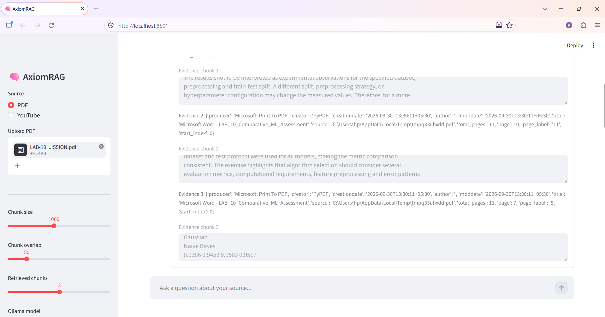
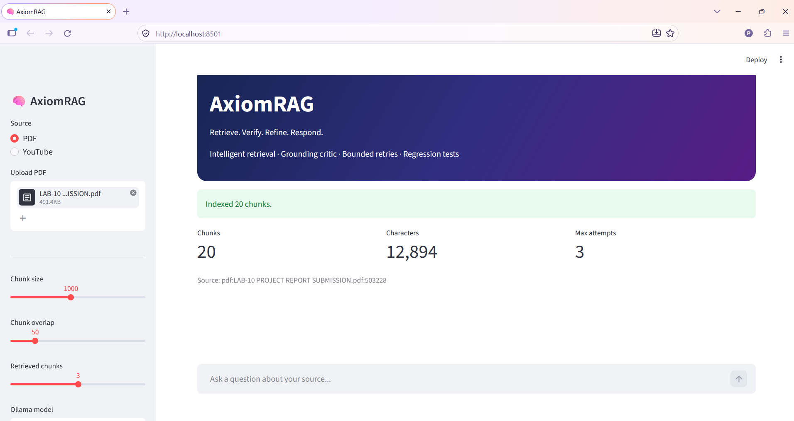
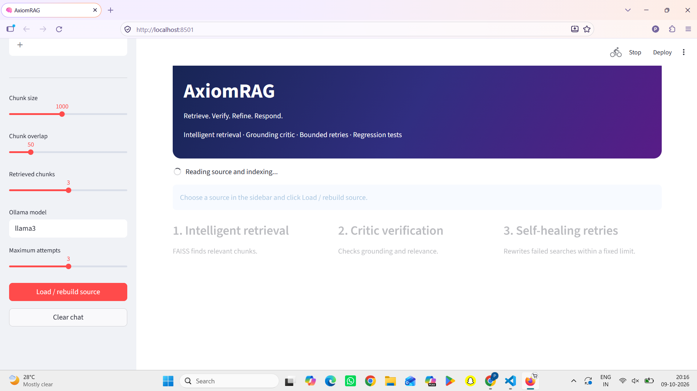
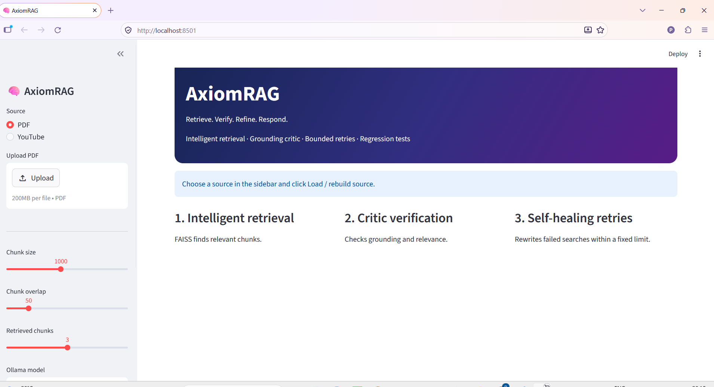
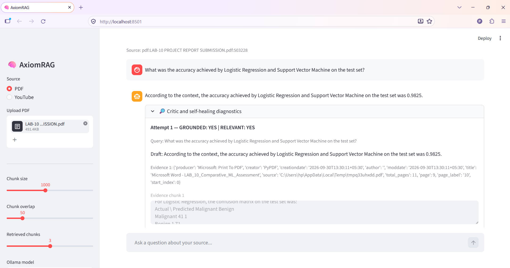

# AxiomRAG — Self-Healing Retrieval-Augmented Generation

**AxiomRAG** is a document-based Retrieval-Augmented Generation (RAG) application designed to answer questions using information retrieved from uploaded documents. It combines semantic retrieval, Large Language Model (LLM) generation, critic-based verification, and bounded retries to improve answer relevance and reduce unsupported responses.

The application provides a Streamlit interface where users can upload documents, ask natural-language questions, inspect retrieved evidence, and view diagnostic information about the answer-generation process.

## Key Features

* **Document-based Question Answering:** Ask questions about uploaded PDF documents.
* **Retrieval-Augmented Generation:** Retrieve relevant document passages before generating answers.
* **Semantic Search:** Use Hugging Face sentence-transformer embeddings and FAISS for vector similarity search.
* **LLM Integration:** Generate answers using locally running models through Ollama.
* **Critic-Based Verification:** Evaluate generated answers for grounding and relevance.
* **Self-Healing Workflow:** Rewrite queries and retry rejected answers within a configured attempt limit.
* **Evidence-Based Responses:** Use retrieved document context to support answers.
* **Insufficient-Evidence Handling:** Return a fallback response when an answer cannot be adequately supported.
* **Diagnostic Visibility:** Inspect attempts, drafts, retrieved evidence, and critic decisions.
* **Automated Tests:** Include tests for selected critic-parsing behavior.

## System Architecture


The architecture illustrates the document-indexing pipeline and the question-answering workflow. The diagram represents the intended design; individual components and connections should be validated against the implementation.

### Workflow Overview

**1. Document ingestion and indexing**

1. Upload a PDF through the Streamlit interface.
2. Extract text from the document.
3. Split the extracted text into smaller chunks.
4. Generate embeddings using a Hugging Face sentence-transformer model.
5. Store the embedded chunks in a FAISS vector store.

**2. Question processing and retrieval**

1. The user submits a natural-language question.
2. The RAG workflow processes the query.
3. FAISS retrieves relevant document chunks.
4. The retrieved context is supplied to the LLM.

**3. Answer generation and verification**

1. Ollama generates a draft answer from the retrieved context.
2. The critic evaluates the draft for grounding and relevance.
3. If the answer is rejected and retries remain, the workflow can rewrite the query and attempt retrieval again.
4. If the configured retry limit is reached without an acceptable answer, the system returns an insufficient-evidence response.

**4. Final response**
The application displays the resulting answer and available diagnostic evidence.

## Technology Stack

| Technology   | Purpose                                 |
| ------------ | --------------------------------------- |
| Python       | Core application language               |
| Streamlit    | Interactive user interface              |
| LangChain    | Document processing and LLM integration |
| LangGraph    | Workflow orchestration                  |
| Hugging Face | Text embedding generation               |
| FAISS        | Vector similarity search                |
| Ollama       | Local LLM inference                     |
| PyPDF        | PDF text extraction                     |
| Unittest     | Automated testing                       |

## Project Structure

```text
AxiomRAG/
├── agent.py
├── app.py
├── main.py
├── test_agent.py
├── requirements.txt
├── README.md
├── .gitignore
├── Screenshots/
│   ├── app-interface.png.png
│   ├── document-indexing.png.png
│   ├── answer-verification.png.png
│   ├── retrieved-evidence.png.png
│   └── rag-workflow.png.png
└── docs/
    └── AxiomRAG System Architecture Flowchart.png
```

The paths above match the image filenames currently present in this repository. The `.png.png` suffixes are intentional here because that is how the files are currently named.

## Getting Started

### Prerequisites

Install the following before running the application:

* Python 3.12
* Git
* Ollama
* A compatible Ollama model, such as `llama3`

### 1. Clone the repository

```bash
git clone https://github.com/palakshah23/AxiomRAG.git
cd AxiomRAG
```

Replace `YOUR_USERNAME` with your GitHub username and use the actual repository name if it differs.

### 2. Create a virtual environment

**Windows PowerShell**

```powershell
python -m venv .venv
.\.venv\Scripts\Activate.ps1
```

If PowerShell blocks activation, use an appropriate execution-policy setting for your environment or activate the environment through VS Code.

### 3. Install dependencies

```powershell
python -m pip install --upgrade pip
pip install -r requirements.txt
```

### 4. Start Ollama

Install Ollama from its official website if it is not already installed.

Download the model:

```powershell
ollama pull llama3
```

Ensure Ollama is running and the model name matches the configuration in `agent.py`.

### 5. Run the application

```powershell
python -m streamlit run app.py
```

Open the local URL displayed in the terminal, typically:

```text
http://localhost:8501
```

## How to Use

1. Launch AxiomRAG.
2. Upload a PDF containing information you want to explore.
3. Wait for text extraction, chunking, embedding generation, and indexing to complete.
4. Enter a question about the document.
5. Review the generated answer.
6. Expand the diagnostic section to inspect the critic's decisions, retrieved evidence, and retry history.
7. Test an unsupported question to evaluate how the application handles missing evidence.

Processing time depends on document size, embedding-model availability, hardware, and the selected LLM.

## Example Evaluation

The following examples were observed during a manual test using a PDF containing a comparative machine-learning experiment.

| Test case                                       | Observed result                                    |
| ----------------------------------------------- | -------------------------------------------------- |
| Question supported by the PDF                   | Correctly returned the reported accuracy of 0.9825 |
| Question about unspecified hardware/GPU details | Returned an insufficient-evidence response         |
| Critic and retry diagnostics                    | Displayed grounding decisions and retry history    |

### Example 1: Supported Question

**Question:** What was the accuracy achieved by Logistic Regression and Support Vector Machine on the test set?

**Observed answer:** Both algorithms achieved a test accuracy of **0.9825 (98.25%)**, according to the uploaded document.

### Example 2: Unsupported Question

**Question:** What specific hardware/GPU configuration was used to train the models?

**Observed answer:** The application reported insufficient evidence because the retrieved context did not establish the hardware or GPU configuration.

These are manual observations from one document. They do not establish a universal accuracy rate or guarantee that all answers will be grounded.

## Running Tests

Run the available automated tests from the project root:

```powershell
python -m unittest test_agent.py -v
```

To check Python syntax:

```powershell
python -m py_compile agent.py app.py main.py test_agent.py
```

The current tests cover selected critic-parsing behavior. Additional tests for retrieval quality, answer grounding, retry limits, document-processing errors, and partial answers would strengthen the project.

## Limitations

* Answer quality depends on the uploaded document, retrieval quality, and selected LLM.
* Relevant information may be missed when chunking or retrieval does not surface the correct passages.
* Critic-based verification is not a formal guarantee against hallucinations.
* Local inference performance depends on available system resources.
* The current evaluation examples are preliminary and do not constitute a comprehensive benchmark.
* Only the document formats and input paths implemented by the application are supported.

## Future Improvements

* Add a reproducible RAG evaluation dataset.
* Measure retrieval quality using metrics such as Recall@K and MRR.
* Evaluate answer faithfulness and relevance using a defined test set.
* Expand automated tests for retry limits and unsupported questions.
* Improve source citations with page-level references.
* Add support for multiple documents and document collections.
* Add structured logging, error handling, and performance monitoring.
* Explore configurable retrieval strategies and reranking.
* Add Docker-based deployment and CI/CD testing.

## Screenshots

### Application Interface



### Document Indexing



### Answer Verification



### Retrieved Evidence



### RAG Workflow



## Learning Outcomes

This project explores practical implementation concepts in:

* Retrieval-Augmented Generation (RAG)
* Embedding-based semantic search
* Vector databases and similarity retrieval
* LLM orchestration with LangGraph
* Critic-based answer evaluation
* Query rewriting and bounded retries
* Evidence-aware question answering
* Automated testing of LLM application components

## Contributing

Contributions and suggestions are welcome. Potential contributions include improving retrieval quality, expanding automated tests, adding evaluation datasets, and enhancing the user experience.

1. Fork the repository.
2. Create a feature branch.
3. Implement and test your changes.
4. Submit a pull request describing the improvement.

## License

Choose and add an appropriate open-source license before distributing the project. Until a license is added, do not assume that others have permission to reuse, modify, or redistribute the code.

---

**AxiomRAG — Retrieve relevant evidence. Generate grounded answers. Verify before responding.**
